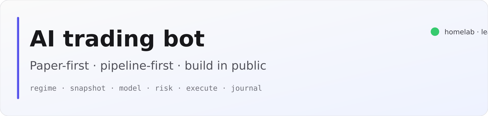

  

  
  &nbsp;
  

# Build in public: one bot, one pipeline, lots of receipts

I am running a **homelab research stack** that ties together market data, a small model loop, a **Python risk engine**, and a broker in **paper** mode first. The point is not a polished product: it is a **transparent notebook** for how automated trading *actually* feels when you wire regime calls, fat snapshots, vetoes, brackets, and a journal that remembers every scratch.

If you are here to **follow along**, watch the commits, read the public site, and poke holes. If something looks dumb, open an issue. I want this repo to read like a build log, not a README that pretends you are going to clone my CT.

---

## Look around (no install required)

| | |
| --- | --- |
| **Live public site** | **[tradebot.followcurly.com](https://tradebot.followcurly.com)** — landing, interactive flow diagram, long-form architecture (all sanitized, educational only). |
| **This repo** | The **Next.js** app under **`site/`** — that is what deploys. Source for the diagrams and prose; no API keys, no broker secrets, no private paths. |

  

**What you will see on the site**

- **`/`** — why the stack exists and how the loop thinks in plain language.  
- **`/flow`** — pan/zoom Mermaid pipeline you can click through (feeds → brain → risk → executor → sinks).  
- **`/architecture`** — redacted deep dive: topology, snapshot shape, risk policies, journal, weekly review.

That site is the friendly front door. The implementation lives elsewhere; this tree is the **documentation surface** I am comfortable shipping to the internet.

---

## Why I am sharing it

- **Paper first** — real order types and guardrails, hypothetical money.  
- **Pipeline-first** — one cycle at a time: regime, watchlist, snapshot, model JSON, risk, execute, log.  
- **Cloud models only** — no “magic local LLM”; inference is a line item I can reason about.  
- **Weekly review** — Sonnet pass over the journal for a human-readable postmortem vibe.

Nothing here is financial advice, a signal service, or an offer to trade your account.

---

## Follow the work

| Where | Link |
| --- | --- |
| **GitHub** | [github.com/followcurly/ai-trading-bot](https://github.com/followcurly/ai-trading-bot) |
| **LinkedIn** | [linkedin.com/in/diazebas](https://www.linkedin.com/in/diazebas/) |

Star or watch the repo if you want updates as the diagrams, copy, and public write-up evolve.

---

## Homelab (context only)

I run the full loop on my own gear (**Proxmox** CT, **Tailscale**, **systemd** services, **Alpaca** paper, **Anthropic**/**OpenRouter** for inference). None of that wiring ships in this repository on purpose.

<strong>Collapsed: stack at a glance</strong>

| Piece | Role |
| --- | --- |
| **Trading scheduler** | Loop: regime → watchlist → snapshot → model → risk → execute → journal |
| **Read-only dashboard** | FastAPI log viewer on the LAN (not published here) |
| **Inference** | Cloud APIs via env (no local Ollama on this stack) |

---

## Disclaimer

Educational and research use. Not financial advice. Not a live trading product. Past (or simulated) performance is irrelevant; the interesting part is the engineering story.
