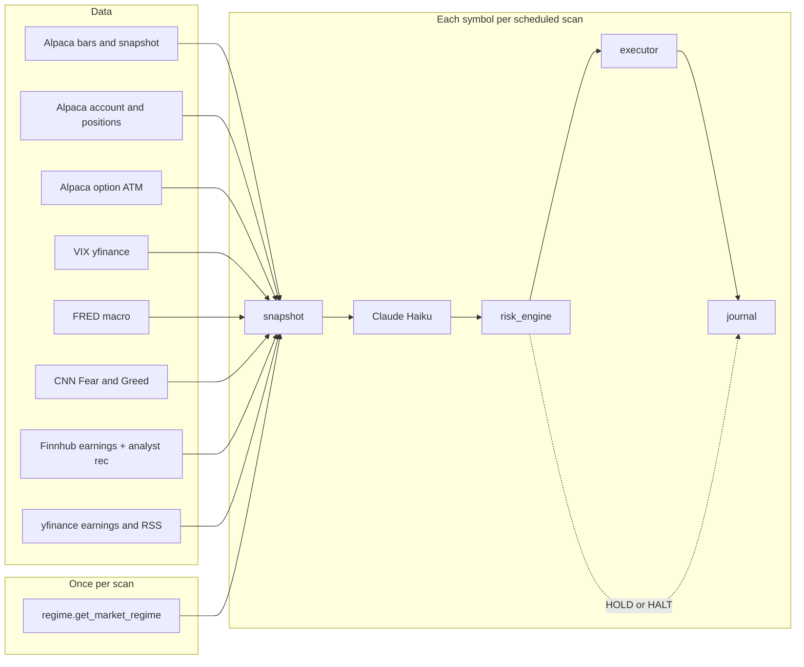
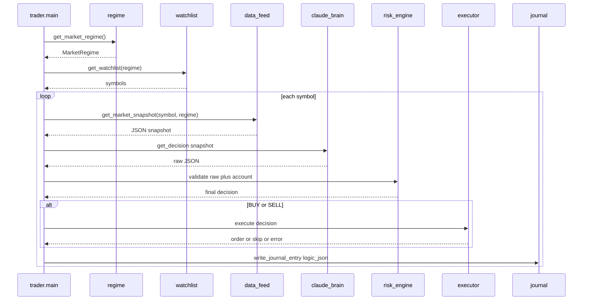

# Trading bot — run on **ai-stack**

**Tunnel:** `ssh -L 8788:127.0.0.1:8788 root@100.72.221.9` then open `http://127.0.0.1:8788/` on your machine (append `?token=...` when `TRADE_LOG_VIEW_TOKEN` is set).

The `trader/` package lives in `**/srv/ai-trading-bot`** on **ai-stack** as a single Proxmox CT; the scheduler and read-only viewer run as two independent **systemd** units (`trading-bot` + `trading-logview`).

**Design reference** (historical — CT 410, Telegram, `/opt/trader` paths from the original spec): [docs/legacy/Homelab_spec.md](legacy/Homelab_spec.md). The live deployment is described here and in `docs/ARCHITECTURE.md`.

---

## What is implemented

- **Daily bars** from Alpaca, indicators in pure **pandas** (`trader/indicators.py`) including **RSI, MACD, EMA, ATR, Bollinger, ADX(14), Stoch RSI, OBV**.
- **Claude** JSON decisions (`trader/claude_brain.py`): **Trader (Haiku) only** per scan cycle — one structured JSON decision per symbol. The trader is **directional momentum** (aligned with optional **`market_regime`** from `trader/regime.py`). Parse failures retry twice, then fall back to a safe-HOLD shell (`_parse_fallback=true`) so one bad symbol cannot halt the cycle. **Weekly** review still uses **Sonnet** (`trader/weekly_review.py`).
- **Deterministic risk** (`trader/risk_engine.py`). `RISK_SOFT_POLICY=true` downgrades PDT ceiling, symbol cooldown, and concurrent-cap blocks to `risk_warnings` only — **BUYs may still execute** even at the PDT ceiling. Do not enable for accounts approaching pattern-day-trader limits.
- `**long_stock` bracket** orders and **single-leg `long_call` / `long_put`** (`trader/executor.py`); other option structures (CSP, spreads) are not executed in code. Option **BUY** size scales with model **confidence** via **`OPTIONS_SIZE_TIERS`**, bounded by **`MAX_OPTIONS_CONTRACTS`** (floor) and **`MAX_OPTIONS_CONTRACTS_HARD`**; see **`docs/MAGIC_NUMBERS.md`**. **Option liquidity gate** (**`OPTIONS_REQUIRE_BID=true`** default) refuses BUYs when `bid<=0` or `ask<=0`, and refuses market SELLs when `bid<=0` — preventing the FNDX-class "no available quote" rejection loop and stopping the bot from opening dormant contracts in the first place.
- **SQLite + JSONL** journal under `data/logs/` by default (`trader/journal.py`), with `**logic_json`** (snapshot excerpt, raw Claude, final risk, execute result). **Size-based rotation**: `journal.jsonl` rotates to `journal.jsonl.YYYYMMDD-HHMMSS` when it crosses **`JOURNAL_MAX_BYTES`** (default 100 MB); `JOURNAL_KEEP_ROTATED` (default 10) prunes oldest copies. The weekly reporter reads rotated siblings alongside the live file so the 7-day window always covers a rotation boundary.
- **Free enrichment**: **yfinance** (earnings window) + optional **RSS** headlines (`trader/enrichment.py`).
- **Macro layer** (`trader/macro.py`): optional **FRED** (`FRED_API_KEY`) and **VIX** (yfinance), TTL-cached; merged into snapshot for Claude and the regime engine.
- **Option ATM context** in snapshot (`trader/options_exec.py` `option_atm_context`): nearest expiry **ATM ± strikes** with **IV / mid** when Alpaca option data returns.
- **Logging** to stderr / `journalctl` (no Telegram).
- **Read-only trade logic UI**: FastAPI app (`trader/web/app.py`) + `**trading-logview.service`** — per-cycle **pipeline strip** on detail pages, `**/flow`** Mermaid diagram + stage notes, and `**/architecture`** (rendered `docs/ARCHITECTURE.md`).
- **Weekly review**: `python -m trader.weekly_review` (`trader/weekly_review.py`).
- **Scheduler**: **four base cron runs per market day** at **10:00, 12:00, 14:00, and 15:30 ET** (Mon–Fri), with **±60s jitter**. Optional **`SCHEDULE_EXTRA_ENABLE`** adds ET times from **`SCHEDULE_EXTRA_SLOTS`** (default `11:30,13:30`). Default **`POSITION_HEALTH_INTERVAL_MIN=5`**: **`run_position_health`** logs open symbols; may fire **deterministic** trail exits when unrealized P&L falls more than **`TRAIL_GIVEBACK_PCT`** (default **0.40**) below the **peak** unrealized P&L per Alpaca position symbol (`trader/main.py`, SQLite `position_trail_state`; multi-day peak unless **`TRAIL_RESET_DAILY=true`**); may also fire **daily-loss emergency flatten** (`DAILY_LOSS_TRIGGER_EXIT_ALL`), **options hard stop** (`OPTIONS_HARD_STOP_PCT`), **profit ladder**, **T-0 expiry sweep**, and set **intraday giveback halt** for new BUYs — see **`docs/MAGIC_NUMBERS.md`**. The same job **journals** automated exits and, unless **`BRACKET_FILL_SYNC_DISABLE=true`**, polls Alpaca **closed** equity **SELL** orders in a lookback window so **GTC bracket** take-profit (**limit**) and stop (**stop** / **stop_limit**) fills appear in **`trades` / JSONL** with `automated_exit.kind` **`bracket_take_profit`** / **`bracket_stop`** (deduped by `order_id`). Set **`POSITION_HEALTH_INTERVAL_MIN=0`** to disable the interval job. **`run_cycle`** only runs during **US RTH** (Mon–Fri 09:30–16:00 ET); **NYSE holiday** skip list (`NYSE_HOLIDAYS` extends defaults in **`trader/market_hours.py`**).
- **EOD summary**: **Mon–Fri 16:05 ET** (America/New_York) writes **`data/reports/eod-YYYY-MM-DD.md`** and **`LATEST_EOD.md`** (override dir with **`DATA_REPORTS_DIR`**) for the dashboard and any ad-hoc reader — same idea as the weekly review artifact.
- **Market snapshot** (`trader/data_feed.py`): daily bars for indicators + **Alpaca stock snapshot (IEX)** for intraday **price**, **prev close**, **change %**, **daily VWAP/volume** where available; **per-symbol position** (qty, avg entry, unrealized P&L); **`portfolio_context`** (all positions + optional **`sector_notional_pct`**); **`data_quality`** (missing critical/optional fields, staleness); **`symbol_sector`** (yfinance, optional **`SECTOR_LOOKUP_DISABLE`**); optional **`market_regime`** (cycle-level pre-brain verdict). Account **daytrade_count** for Claude + risk.
- **Risk** (`trader/risk_engine.py`): optional `**MAX_CONCURRENT_BUYS`** (default 1, `0` = off) and `**MAX_ADD_TO_POSITION`** to block pyramiding; optional **`MAX_SECTOR_NOTIONAL_PCT`** vs sector exposure in the snapshot; `**ATR_MULTIPLIER_*`** envs tune bracket stop/TP floors in `**trader/executor.py`** (bracket orders use `**GTC**` so exit legs do not expire at the close).
- **Watchlist** (`trader/watchlist.py`): Alpaca most-actives after filters, capped at **`WATCHLIST_SCREENER_SIZE`** (default **20**; legacy **`WATCHLIST_SIZE`** when unset). **`WATCHLIST_INCLUDE_OPEN_POSITIONS`** (default **true**) appends **every** held underlying **after** that slice — never truncated. When the pre-brain is bearish enough, **inverse/volatility** names from the verdict are merged (see **`REGIME_*`** envs); skipped when **`TRADING_WATCHLIST`** static override is set. Optional deny lists, max spread % (IEX quotes), min market cap / avg dollar volume (yfinance, cached). **`WATCHLIST_ENFORCE_MIN_PRICE`** defaults to **true** in code; set **false** to skip the **`WATCHLIST_MIN_PRICE`** last-trade filter.
- **Regime pre-brain** (`trader/regime.py`): **`get_market_regime()`** runs **once per scan cycle** (TTL **`REGIME_TTL_SEC`**, default 15 min) — one Haiku JSON verdict over cross-asset inputs (SPY/QQQ slices, VIX, macro, Fear & Greed). Injected into **`get_watchlist(regime=...)`** as inverse/volatility tickers when bearish above **`REGIME_BEARISH_INJECT_THRESHOLD`**; merged into each snapshot as **`market_regime`**. Set **`REGIME_DISABLE=true`** to skip. See **`docs/MAGIC_NUMBERS.md`**.
- **Observability**: end-of-cycle **`cycle_summary`** JSON log line (includes a compact **`market_regime`** object); optional **`TRADING_METRICS_JSONL_PATH`** for one JSON line per cycle.
- **Offline eval**: **`scripts/journal_forward_returns.py`** — forward returns from journal BUY **`long_stock`** rows (yfinance; research only).
- **Tests**: **`pytest`** + **`tests/`** — run from repo root: `python -m pytest` (see **`pytest.ini`**).
- **Dashboard**: `**/positions`** shows live Alpaca paper open positions; index strip shows **daytrade_count** when the API is reachable.

### Architecture (data → decision)




### Per-cycle sequence

Each RTH run starts with **`get_market_regime()`** (cached Haiku cross-asset verdict), then **`get_watchlist(regime=...)`**: anchors → optional bearish hedge tickers → screener slice → dedupe → append held underlyings (uncapped). Then the symbol loop below.




### Data sources (snapshot fields)


| Source             | Module / call                              | Cache TTL (typical)    | Snapshot keys                                             |
| ------------------ | ------------------------------------------ | ---------------------- | --------------------------------------------------------- |
| Alpaca Market Data | `data_feed` + `alpaca_runtime.data_client` | per request            | `price`, `timestamp`, `indicators.*`, IEX snapshot fields |
| Alpaca Trading     | `data_feed`                                | per request            | `account`, `position`                                     |
| Alpaca Options     | `options_exec.option_atm_context`          | per request            | `options` (atm, strikes_ring)                             |
| Anthropic          | `claude_brain`, `regime`                   | regime: per `REGIME_TTL_SEC`; trader: per symbol | model output; `market_regime` on snapshot when enabled |
| yfinance           | `enrichment`, `macro`                      | 6h earnings; 30m VIX   | `earnings_*`, `vix`                                       |
| RSS                | `enrichment`                               | 30m                    | `news_headlines`                                          |
| FRED               | `macro`                                    | 6h (`MACRO_TTL_SEC`)   | `macro` (needs `FRED_API_KEY`)                            |
| CNN Fear & Greed   | `sentiment.fetch_fear_greed`               | 1h (`FEAR_GREED_TTL_SEC`) | `fear_greed` (no auth; feeds the regime engine)        |
| Finnhub            | `finnhub.fetch_earnings_calendar/recommendation` | 6h         | `earnings_calendar`, `analyst_recommendation` (needs `FINNHUB_API_KEY`) |


**Optional env keys:** `FRED_API_KEY` and `FINNHUB_API_KEY` are **optional**. If unset, the corresponding snapshot fields are omitted (by design — not an error). **VIX** uses yfinance and should populate `vix` after a normal cycle without extra keys. `**data_feed`** calls `enrich_macro(snap)` and `option_atm_context(symbol, live_price)` each cycle when enrichment is enabled.

---

## 1. One env file

Edit `**/root/.openclaw/api.env`** (legacy path retained for compatibility; same file as `/srv/ai-trading-bot/.env` via symlink). Append **Alpaca** and optional enrichment / log viewer vars — see [.env.example](../.env.example).

Minimum for paper trading:

```bash
ALPACA_API_KEY=...
ALPACA_SECRET_KEY=...
ALPACA_BASE_URL=https://paper-api.alpaca.markets
```

Use the **host only** — not `.../v2`. The Alpaca Python SDK appends `/v2` to paths; if you put `/v2` on the base URL you get broken URLs like `.../v2/v2/...`. The code strips a trailing `/v2` if present, but the correct value is still:

```text
https://paper-api.alpaca.markets
```

`ANTHROPIC_API_KEY` belongs in this same env file; the trading bot reads it for Claude.

**Alpaca MCP in Cursor** (separate from `trader/`): [docs/CURSOR_ALPACA_MCP.md](CURSOR_ALPACA_MCP.md) — official docs hub [docs.alpaca.markets/docs](https://docs.alpaca.markets/docs).

**Market data (free paper):** The bot uses the production **data** host with the **IEX** feed (`DataFeed.IEX`). The sandbox data URL often returns **401** for paper keys, and the default SIP feed requires a paid subscription (“recent SIP data” error).

**Optional enrichment:** set `**NEWS_RSS_URLS`** to a comma-separated list of RSS feed URLs (headlines are cached ~~30 minutes). Earnings hints use **yfinance** with a per-symbol cache (~~6 hours).

Reload nothing for file edits until you restart a service. The **trading-bot** and **trading-logview** units use `EnvironmentFile=` so they pick up variables when **those** services start.

---

## 2. Python venv (once)

```bash
cd /srv/ai-trading-bot
python3 -m venv .venv
source .venv/bin/activate
pip install -r requirements.txt
```

---

## 3. Logs directory (default: repo disk)

By default journals go to `**/srv/ai-trading-bot/data/logs/**` (gitignored).

Later, if you mount TrueNAS and want logs off the CT disk, set before starting the bot:

```bash
export TRADING_LOG_DIR=/mnt/trading-logs
```

(and add the same line to `api.env` or the systemd `Environment=` block).

---

## 4. Smoke test (Alpaca + indicators)

```bash
cd /srv/ai-trading-bot
source .venv/bin/activate
set -a && source /root/.openclaw/api.env && set +a

python -c "
from dotenv import load_dotenv
load_dotenv('/root/.openclaw/api.env')
from trader.data_feed import get_market_snapshot
import json
print(json.dumps(get_market_snapshot('SPY'), indent=2, default=str))
"
```

---

## 5. Run the scheduler manually (foreground)

```bash
cd /srv/ai-trading-bot
source .venv/bin/activate
set -a && source /root/.openclaw/api.env && set +a
python -m trader.main
```

`Ctrl+C` to stop. This is independent from the systemd unit.

---

## 6. systemd — `trading-bot.service` (background)

Committed copy: **[deploy/trading-bot.service](../deploy/trading-bot.service)**.

```bash
sudo cp /srv/ai-trading-bot/deploy/trading-bot.service /etc/systemd/system/trading-bot.service
sudo systemctl daemon-reload
sudo systemctl enable --now trading-bot
systemctl status trading-bot
journalctl -fu trading-bot
```

**One-line health check** (Alpaca trading + IEX bars for SPY): run **[scripts/trader-health.sh](../scripts/trader-health.sh)** (executable):

```bash
/srv/ai-trading-bot/scripts/trader-health.sh
```

**Enrichment / API audit** (which snapshot layers are live vs missing keys): **[scripts/check_apis.py](../scripts/check_apis.py)** — loads `.env` and `/root/.openclaw/api.env`, probes each provider, prints an **enrichment layer availability** summary. Requires `lxml` for the yfinance earnings probe (in `requirements.txt`).

**Operate:**


| Goal                        | Command                                       |
| --------------------------- | --------------------------------------------- |
| Restart **only** the trader | `systemctl restart trading-bot`               |
| Restart the read-only viewer | `systemctl restart trading-logview`          |
| Stop trader                 | `systemctl stop trading-bot`                  |


---

## 6b. Trade logic web UI (`trading-logview`)

**Alpaca paper** = where **orders and fills** live. This UI = **why** each cycle decided what it did (read-only, no trades from the browser).

- **Install:** `sudo cp /srv/ai-trading-bot/deploy/trading-logview.service /etc/systemd/system/` then `sudo systemctl daemon-reload && sudo systemctl enable --now trading-logview`
- **Script:** [scripts/run-logview.sh](../scripts/run-logview.sh) (loads `api.env`, runs uvicorn)
- **Bind:** `TRADE_LOG_HOST` (default `127.0.0.1`), `TRADE_LOG_PORT` (default `8788`). Remote access: use the **Tunnel** one-liner at the top of this file.
- **Auth:** if `**TRADE_LOG_VIEW_TOKEN`** is set in `api.env`, every URL must include `**?token=...`** matching that value.
- **After `git pull`:** restart the viewer so new routes and templates load: `sudo systemctl restart trading-logview`. If `**/architecture`** returns JSON `{"detail":"Not Found"}`, uvicorn is still running an **old** build — restart fixes it. Optional: set `**ARCHITECTURE_DOC_PATH`** in `api.env` if `docs/ARCHITECTURE.md` is not under the default repo root.

### Reading the dashboard

- **Filter:** use the **Symbol** dropdown (or `?symbol=TICKER`) and optional `**?limit=`** (default 100, max 500). **Refresh** reloads the current filter.
- **Rows:** each line is one journal cycle for that symbol. **Action chips** are BUY / SELL / HOLD / HALT. Click anywhere on the row for the **detail** page.
- **Detail cards:** **Decision pipeline** (Snapshot → Brain → Risk → Execute) summarizes the cycle path; **Model confidence** is from Claude's raw JSON; **Post-risk reason** appears when the risk engine changed the action (e.g. confidence gate); **Executor status** is from Alpaca (skipped / filled / error). Expand **Snapshot / Raw Claude / Final / Execute** for each slice of `logic_json`; the **Full payload** block is the complete JSON.
- **Flow:** open `**/flow`** (nav link) for the **system** Mermaid diagram (feeds → per-cycle pipeline → sinks) plus stage-by-stage notes aligned with `docs/ARCHITECTURE.md`. Cadence line at the top reflects optional **`SCHEDULE_EXTRA_*`** / **`POSITION_HEALTH_INTERVAL_MIN`** when those env vars are set on the host running **trading-logview**. `**/architecture`** renders the same long-form doc from disk (`docs/ARCHITECTURE.md`).
- **HOLD vs HALT:** **HOLD** means “do nothing this cycle” (often gated by risk or model). **HALT** is a stronger circuit-breaker (e.g. daily loss or drawdown-from-peak — see `trader/risk_engine.py`).
- **Health:** `GET /healthz` returns `{"ok": true, "rows": N}` for a quick DB check (still requires `**?token=...`** when the viewer token is configured).
- **Positions:** open `**/positions`** (nav link) for a live table from Alpaca paper (not the SQLite journal). The cycles index strip also shows **daytrade_count** / **PDT** when Alpaca responds.

**Logs from the bot (not the UI):** `journalctl -u trading-bot -f`

---

## 7. Weekly Sonnet review (cron example)

The job aggregates **JSONL + SQLite** (and optional `WEEKLY_HUMAN_JOURNAL_PATH`, Alpaca closed orders unless `WEEKLY_ALPACA_ORDERS_DISABLE`), adds **`bot_operating_snapshot`** (resolved watchlist screener size, option tier caps, trail giveback) to the Sonnet payload so reviews align with current sizing rules, calls **Sonnet**, and writes:

- `data/reports/LATEST_REVIEW.md` — stable path; also served by the log viewer at `GET /report/latest.md`.
- `data/reports/weekly-YYYY-MM-DD.md` / `.json` (JSON sidecar includes `bot_operating_snapshot`), `TRADER_FEEDBACK.md` (short bullets for `claude_brain` when fresh).
- `data/reports/blog-YYYY-MM-DD.md` + `blog-YYYY-MM-DD.charts.json` — human-readable post + SVG charts surfaced on the dashboard at **`/blog`** and `/blog/{slug}`. The dashboard is the only delivery channel; nothing is posted externally on its own. Posts support **YAML frontmatter** (`title`, `date`, `kind`, `subtitle`, `draft`, `featured`, `charts`, `tags`); evergreen posts (e.g. the launch announcement) live as committed seeds under [`trader/reporting/blog_seeds/`](../trader/reporting/blog_seeds/) and are copied into `data/reports/` on first request without ever overwriting live edits. Hero copy, nav label, cadence, and disclaimer come from `BLOG_*` env vars wired through [`trader/web/blog_config.py`](../trader/web/blog_config.py). Full authoring guide: [docs/BLOG.md](BLOG.md).

```bash
(crontab -l 2>/dev/null; echo "0 20 * * 0 cd /srv/ai-trading-bot && . .venv/bin/activate && set -a && . /root/.openclaw/api.env && set +a && python -m trader.weekly_review >> /srv/ai-trading-bot/data/logs/weekly_review.log 2>&1") | crontab -
```

Adjust time if you like. Logs land under `data/logs/` unless you set `TRADING_LOG_DIR`. Reports default to `data/reports/` unless you set `DATA_REPORTS_DIR`.

---

## 8. Optional: Healthchecks.io dead-man switch

Set `HEALTHCHECK_URL` in `api.env` (see homelab spec). `trader/main.py` pings it after each scan cycle that **finishes without per-symbol exceptions**; if any symbol raised, it requests `**…/fail`** (same host path as healthchecks.io) unless you set `**HEALTHCHECK_FAIL_URL`** explicitly. Structured **`cycle_summary`** is logged either way; set **`TRADING_METRICS_JSONL_PATH`** to persist per-cycle JSON lines for dashboards or grep.

**Grace time:** On the Healthchecks.io check, set **grace time to about 75 minutes** so a missed afternoon window (or a long silent gap between cron fires) alerts within roughly an hour. The bot’s base schedule is only four times per session; a too-short grace causes false “up” pings.

---

## Divergences from the original homelab `/opt/trader` snippets

- Code is the `**trader/`** package; entrypoint is `**python -m trader.main`**.
- **pandas-ta** was replaced by `**trader/indicators.py`** (install reliability on Python 3.11).
- Alpaca / Anthropic clients are **lazy** so imports work without keys.

